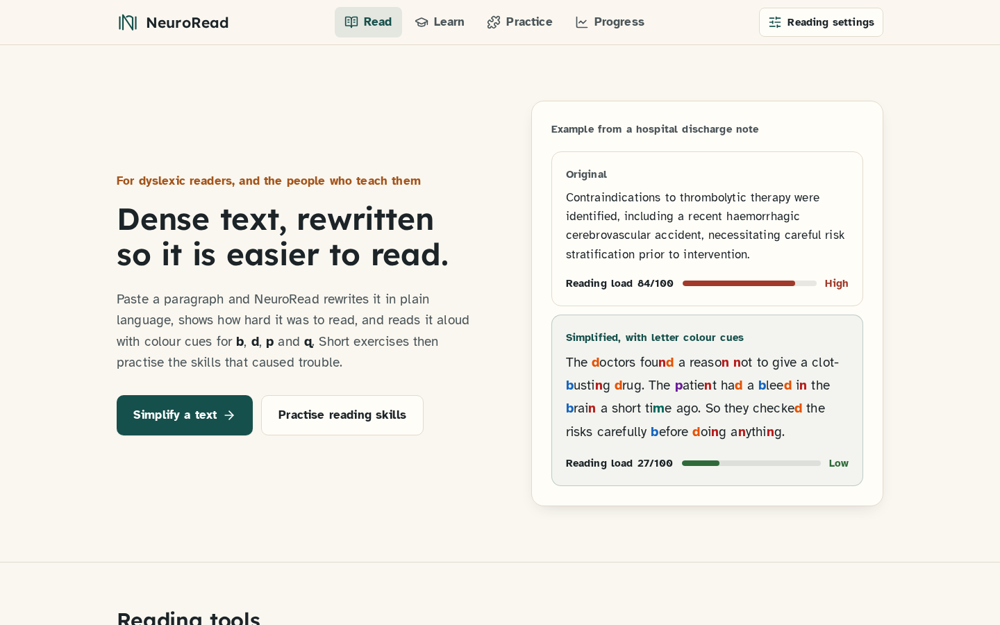
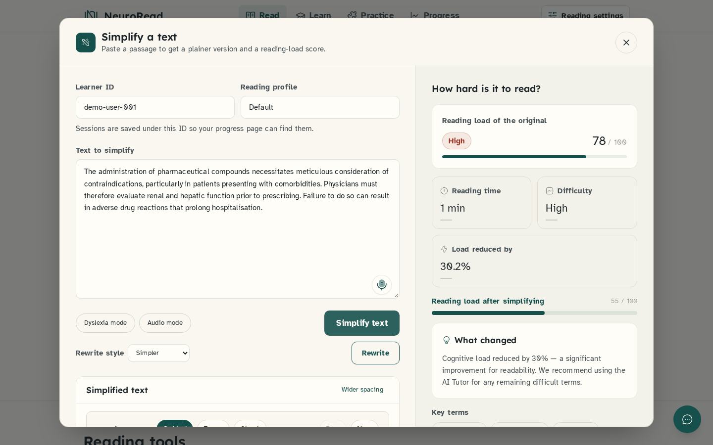
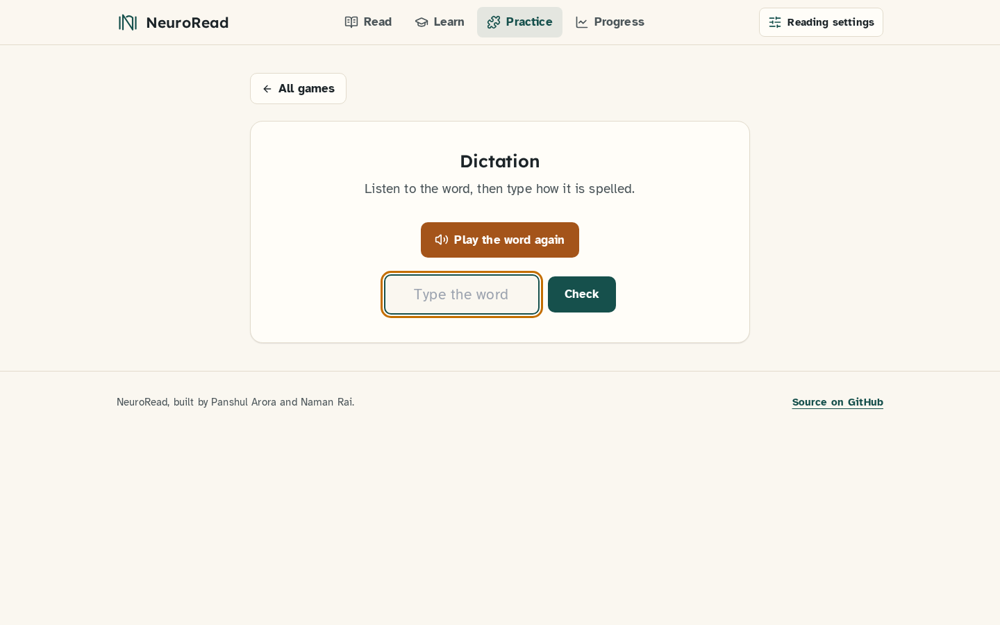
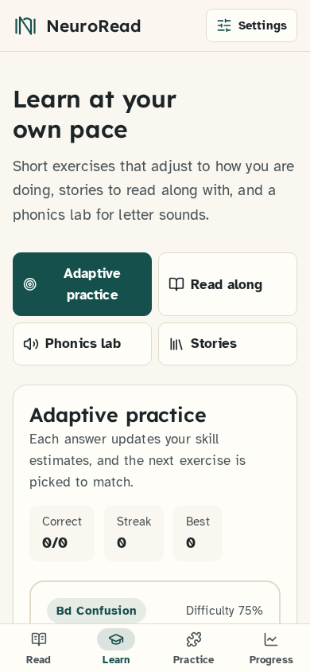

# NeuroRead: adaptive reading platform for dyslexic learners

[](https://github.com/panshularora/NEUROREAD/actions/workflows/tests.yml)

**What:** a web app for dyslexic readers. Paste or upload dense text and it is simplified, scored for cognitive load and read aloud with b/d/p/q colour coding. Children get adaptive phonics exercises and nine short practice games; every session feeds a progress dashboard.
**Why:** dense text is a barrier for dyslexic readers. Simplifying the text and then practising the specific weak skills (b/d distinction, spelling, syllables, homophones) targets both problems.
**Recognition:** 1st place of 200+ teams at the WiCyS hackathon. <!-- Panshul: confirm the exact event name/year and whether it was entered as "NeuroCare" -->
**Team:** built by Panshul Arora and [Naman Rai](https://github.com/namanraii) and [Tanmay Singh](https://github.com/tannnmayy). The code here is kept in sync with the final team version in [namanraii/NeuroRead](https://github.com/namanraii/NeuroRead).

**Status (Sep 2026):** the full app runs locally. The frontend is live at [neuroread-final-main-everyhting.vercel.app](https://neuroread-final-main-everyhting.vercel.app) (built from the [`neuroread-final-main-everyhting`](https://github.com/panshularora/neuroread-final-main-everyhting) deploy repo). The backend is not deployed yet, so the live site shows a "server isn't connected" notice and only the reading settings work there; run the backend locally for simplifying, lessons, games and progress. The 43 tests in `tests/` run in GitHub Actions on every push.

| Home | Simplifier |
|---|---|
|  |  |
| **Practice game** | **Learning (mobile)** |
|  |  |

## Features

| Area | What it does |
|---|---|
| **Smart Simplifier** (Assistive) | Rewrites text with Llama 3.1 8B via Groq at a level picked from the reader profile or the text's cognitive load. Returns the simplified text, bullet points, definitions, step-by-step explanation, before/after cognitive-load scores and keywords. Without an API key a deterministic rule-based simplifier runs instead: it swaps jargon for plain words, drops filler linking words and splits long sentences, and lists the swapped words as definitions |
| **Cognitive load score** | 0-100 from Flesch reading ease (40%), sentence length (30%) and complex-word ratio (30%), computed with textstat and spaCy |
| **Reading settings** | Atkinson Hyperlegible by default with an OpenDyslexic option, adjustable text size, letter and line spacing, warm-paper, soft-tint and dark themes, a reading ruler (move it with Alt+arrow keys), tinted overlays and b/d/p/q letter colouring; settings persist in `localStorage` |
| **Read aloud** | Word-by-word read-aloud with highlighting (gTTS on the backend, the browser's speech synthesis as a fallback) |
| **Documents and OCR** | Upload PDF/DOCX/TXT for server-side extraction and simplification; photos and camera captures are read in the browser with Tesseract.js |
| **AI tutor, vocab cards, concept graph, heatmap** | Ask questions about a passage, get vocabulary cards and a keyword graph, see which sentences are hardest |
| **Learning Mode** | Adaptive exercises. After every answer Bayesian Knowledge Tracing updates P(know) per skill, IRT 2PL scores the item, a ZPD rule adjusts difficulty and SM-2 schedules the next review. Also Read along, Phonics lab and Stories |
| **Practice Mode** | Nine mini-games: dictation (phonetic spellings accepted), error correction, b/d word sorting, syllable tapping, word chains, sentence builder, rhyme finder, speed flashcards, homophones |
| **Progress** | Reading sessions (time, pauses, errors, difficult words) with a behavioural cognitive-load score, trend, difficulty distribution and plain-language insights. The PDF report uses only the logged data and says it is not a diagnosis |
| **Accessibility** | Keyboard navigation with visible focus, skip link, labelled dialogs with focus management, `prefers-reduced-motion` support, a mobile tab bar, and a clear notice instead of silent failures when the API is unreachable |

The learner models (`backend/app/ml/bkt_engine.py`, `irt_scorer.py`, `sm2_scheduler.py`, `zpd_flow.py`) are hand-implemented with fixed parameters. Nothing is trained from data.

---

## How to run

### Prerequisites
- Python 3.11
- Node.js 18+ (20 recommended)
- Optional: a Groq API key (free at https://console.groq.com). Without it the simplifier uses the rule-based fallback and the tutor replies that the key is missing.

### 1. Backend

```bash
cd ai-accessibility-assistant-main/backend
python -m venv .venv && source .venv/bin/activate
pip install -r requirements.txt
python -m spacy download en_core_web_sm   # optional, improves sentence splitting

cp .env.example .env                       # then set GROQ_API_KEY
uvicorn app.main:app --reload --port 8000
```

Check it with `curl http://localhost:8000/health`. Interactive API docs are at `http://localhost:8000/docs`.

Environment variables: `GROQ_API_KEY`, `CORS_ORIGINS` (comma-separated, default `*`), `DATABASE_URL` (default `sqlite:///./neuroadapt.db`), `NEUROREAD_USE_KEYBERT=1` to use KeyBERT for keywords (needs `pip install keybert`, which pulls in torch).

### 2. Frontend

```bash
cd ai-accessibility-assistant-main/ai-accessibility-assistant-frontend-main
cp .env.example .env                       # VITE_API_URL=http://localhost:8000
npm ci
npm run dev
```

The app opens at `http://localhost:5173`. `npm run build` writes a static build to `dist/`.

### 3. Tests

```bash
cd ai-accessibility-assistant-main
pip install -r backend/requirements.txt pytest
python -m pytest tests/ -v
```

No API key is needed. `tests/test_api.py` runs against the FastAPI app with a throwaway SQLite file. `backend/smoke_test.py` hits a running server (`NEUROREAD_API_URL`, default `http://127.0.0.1:8000`).

---

## Deployment

- **Backend (Render):** `render.yaml` at the repo root is a Render Blueprint (root directory `ai-accessibility-assistant-main/backend`, start command `uvicorn app.main:app --host 0.0.0.0 --port $PORT`, health check `/health`). Set `GROQ_API_KEY` in the Render dashboard.
- **Frontend (Vercel):** import the repo, set **Root Directory** to `ai-accessibility-assistant-main/ai-accessibility-assistant-frontend-main` (framework preset Vite; `vercel.json` there adds the SPA fallback) and set `VITE_API_URL` to the Render URL.

---

## Architecture

```
ai-accessibility-assistant-main/
  backend/                      FastAPI
    app/main.py                 app, CORS, router registration
    app/ml/                     BKT, IRT, SM-2, ZPD, exercise and practice-game generator
    app/routes/assistive/       simplify, tts, tutor, annotate, document, heatmap, ...
    app/routes/learning/        adaptive session API, phonics, spelling, practice games
    app/services/               simplifier, cognitive load, analytics, personalization, LLM client
    app/models/                 SQLAlchemy models (SQLite by default)
  ai-accessibility-assistant-frontend-main/   React 19 + Vite + Tailwind + Zustand
    src/components/             modes, practice games, accessibility tools
    src/pages/Dashboard.tsx     progress page
    src/services/api.js         API client (VITE_API_URL)
  tests/                        pytest
```

## Key API endpoints

| Method | Endpoint | Description |
|---|---|---|
| GET | `/health` | `{"status": "ok", "version": "2.0"}` |
| POST | `/assistive/simplify` | Simplify text, return before/after cognitive load, bullets, definitions, keywords |
| POST | `/assistive/difficulty-check` | Decide whether a passage needs simplifying for a reader |
| POST | `/assistive/annotate` | Per-character phoneme colours |
| POST | `/assistive/tutor` | Ask a question about a passage |
| POST | `/assistive/document` | Upload PDF/DOCX/TXT |
| POST | `/api/learning/session/start` | Start an adaptive learning session |
| POST | `/api/learning/session/{id}/answer` | Submit an answer, get the BKT/IRT/SM-2 update |
| GET | `/api/learning/practice/generate?game_type=` | Next item for a practice game |
| POST | `/api/learning/practice/evaluate/dictation` | Phonetic-tolerant spelling check |
| POST | `/analytics/session` | Log a reading session |
| GET | `/analytics/dashboard/{user_id}` | Dashboard data and insights |

---

## Research references

| Model | Reference |
|---|---|
| **BKT** (Bayesian Knowledge Tracing) | Corbett, A. T., & Anderson, J. R. (1994). Knowledge tracing: Modeling the acquisition of procedural knowledge. *User Modeling and User-Adapted Interaction*, 4(4), 253–278. |
| **IRT** (Item Response Theory) | Lord, F. M. (1952). *A Theory of Test Scores*. Psychometric Monograph No. 7. |
| **ZPD** (Zone of Proximal Development) | Vygotsky, L. S. (1978). *Mind in Society*. Harvard University Press. |
| **SM-2 spaced repetition** | Wozniak, P. A. (1987). Optimization of learning. MSc thesis, University of Economics, Poznań. |
| **Colour overlays** | Wilkins, A. J. (2004). *Reading Through Colour*. Wiley. |
| **Phonological awareness** | Snowling, M. J., & Hulme, C. (2011). Evidence-based interventions for reading and language difficulties. *Journal of Child Psychology and Psychiatry*, 52(4), 381–392. |

## Demo path (3 minutes)

1. Open the app and finish onboarding (age 8, "Reading words aloud" + "Spelling").
2. Read: click "Simplify a text", paste a medical paragraph, simplify, compare the before/after reading load, turn on dyslexia mode and read it aloud.
3. Learn → Adaptive practice: answer a few phonics items and watch the b/d skill bar move.
4. Practice: play Dictation (try "laf" for "laugh") and Word sorting.
5. Progress: see the logged sessions and the insights.
6. Reading settings: switch to OpenDyslexic, turn on the ruler and a tinted overlay.

## License

MIT
